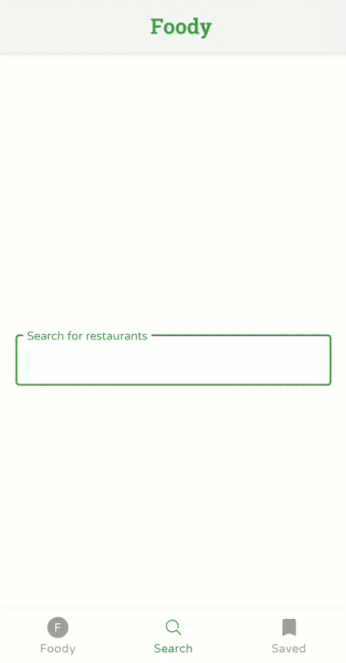

# Zomato Api (Offline First)

#### Setup API Key
1. Visit [Zomato](https://developers.zomato.com/api) to generate your API Key
2. Open `gradle.properties` *(Create the file if not exists)*
   - Add the following line:
    ```
    ApiKey="YOUR_API_KEY"
    ``` 
#### DEMO

     
#### Libraries
- [Android X](https://developer.android.com/jetpack/androidx)
- [Retrofit](http://square.github.io/retrofit/)
- [Room](https://developer.android.com/topic/libraries/architecture/room)
- [Glide](https://github.com/bumptech/glide)
- [LiveData and ViewModel](https://developer.android.com/topic/libraries/architecture/)
- [DataBinding](https://developer.android.com/topic/libraries/data-binding/)


